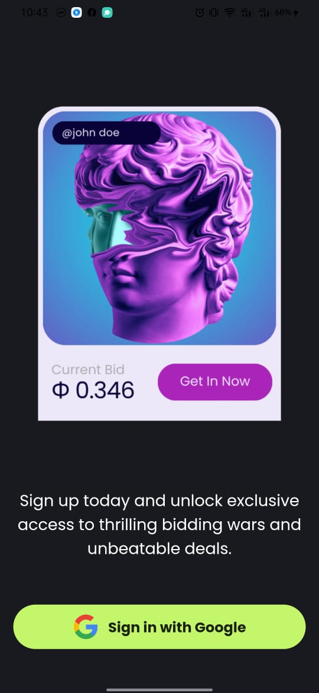
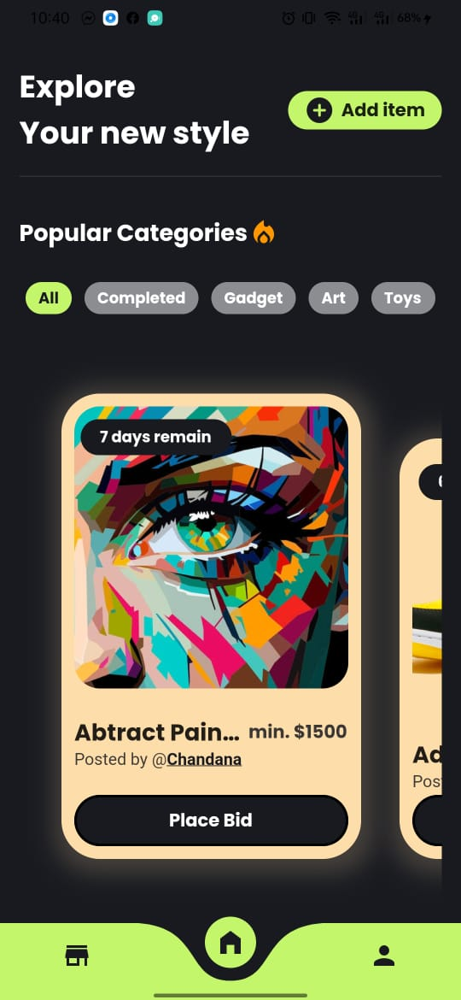
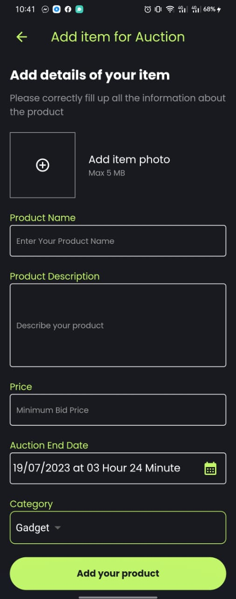
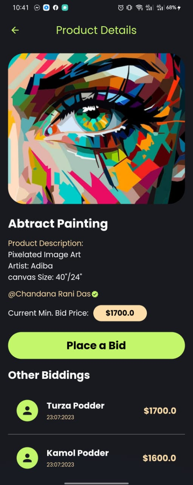
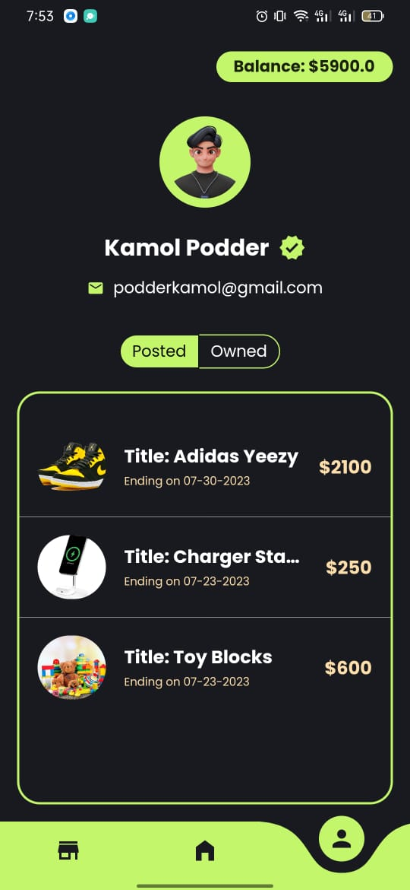
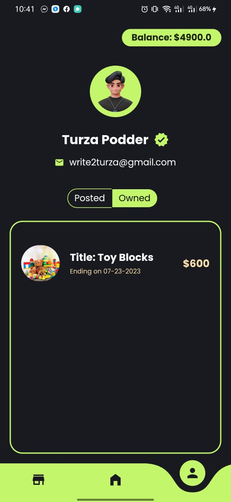
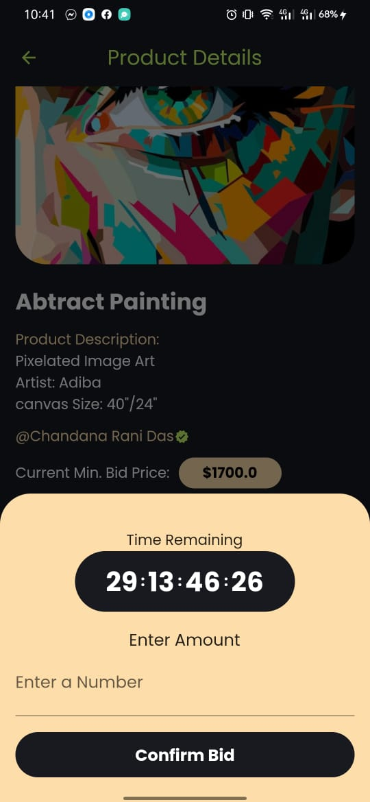
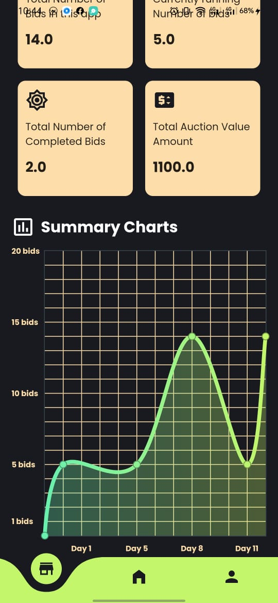

# Flutter-Auction-App

## BidArt

The Flutter Firebase auction app with Google Sign-In is a mobile application that allows users to participate in online auctions. Users can sign in using their Google accounts for authentication. The app enables users to browse and bid on various auction items, view real-time bidding updates, and receive notifications on auction status. The integration with Firebase backend ensures secure user authentication, real-time data synchronization, and seamless bidding experiences for users. The app offers an interactive and engaging platform for users to explore and participate in auctions conveniently from their mobile devices.

## Features

- **Google One-Time Sign In**
- **Interactive UI**
- **Auction Item Listing**
- **Place Bidding on a item**
- **Dashboard for Results and reports**
- **Winner Announcement**
- **Profile Page with Posted & Owned Item**


## References & Inspiration
- ### UI Design
    - [Artello – Creative NFT Auction App](https://dribbble.com/shots/19997565-Artello-Creative-NFT-Auction-App)
    - [Sneakers Auction Mobile IOS App](https://dribbble.com/shots/19933053-Sneakers-Auction-Mobile-IOS-App)
    - [Auction Mobile IOS App](https://dribbble.com/shots/21184521-Samurai-Armor-Auction-App-Concept)

- ### Firebase Concept & other Tutorials
    - [Youtube](https://www.youtube.com)
    - [Google](https://www.google.com)
    - [Stack-Overflow](https://www.stackOverflow.com)

## Installation
BidArt requires [Flutter & Dart](hhttps://docs.flutter.dev/get-started/install) v3.0+ to run.

Install the dependencies and devDependencies and start the server.

`flutter pub get`

you also need to setup a firebase Account and generate `google-service.json` file and add sha-1 and sha-2 key to the firebase to run.

Code to generate Sha-1 and Sha-2
```
keytool -list -v -keystore "\.android\debug.keystore" -alias androiddebugkey -storepass android -keypass android
```

then run the project
```
flutter run
```

## Packages/Library used

```
  curved_navigation_bar: ^1.0.3
  image_picker: ^1.0.1
  firebase_core: ^2.15.0
  firebase_auth: ^4.7.1
  google_sign_in: ^6.1.4
  shared_preferences: ^2.2.0
  cloud_firestore: ^4.8.3
  firebase_storage: ^11.2.5
  fluttertoast: ^8.2.2
  slide_countdown: ^0.6.0
  intl: ^0.17.0
  fl_chart: ^0.63.0
```


## Screenshots

[](SplashScreen)
[](OnboardingScreen)
[](SignInscreen)
[](HomescreenScreen)
[](AddItemScreen)
[](ProductPageScreen)
[](ProfileScreen)
[](Profile_owned_itemScreen)
[](TimePlaceBidScreen)
[](DashboardScreen)

## Challenges
- Actually, Finding the winner when the auction time ends was the trickiest part because generally, we use cloud functions to automate the script online so that we don't have to do it manually. So, I have written a method to check whenever a user enters a product page it will check the current time and the auction time difference. If the difference is found it will trigger another firebase method to update the auction item status as completed and declare the highest bidder from the list as winner.
- I am working in Flutter for a couple of months now, but I didn't make any charts widgets in my apps till now. So, to do that I had to watch lots of youtube videos. Now I can assure you that I can build any type of chart.
- Another trivial and important issue for me was the timing and my environment, because I went to my village with my regular laptop so, building the app with a low-powered laptop was quite a hassle and let's not talk about electricity. If these issues were not present I could make this project in two-three days
    


